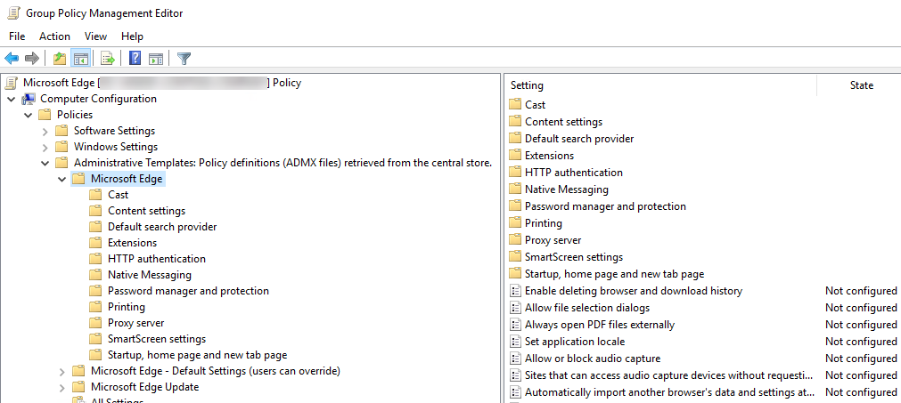
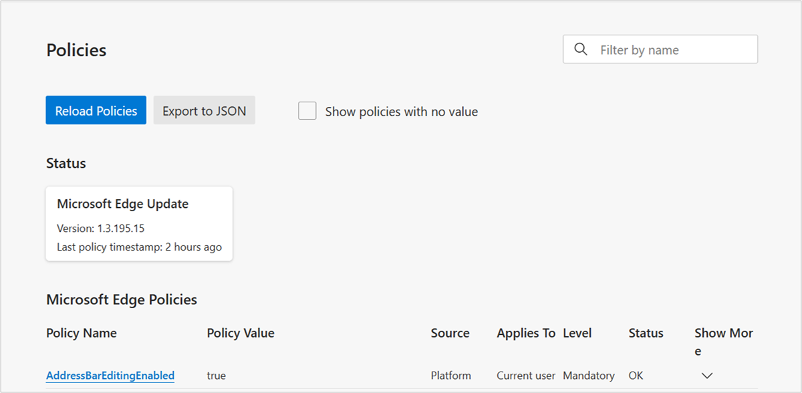

# Configure Microsoft Edge policy settings on Windows

Use the following information to configure Microsoft Edge policy settings on your Windows devices.

> [!NOTE]
> This article applies to Microsoft Edge version 77 or later.

## Configure policy settings on Windows

You can use _group policy objects (GPO)_ to configure policy settings for Microsoft Edge and managed Microsoft Edge updates on all versions of Windows. You can also provision policy through the registry for Windows devices that are joined to a Microsoft Active Directory domain, or Windows 10 Pro or Enterprise instances enrolled for device management in Microsoft Intune. To configure Microsoft Edge with group policy objects, you install _administrative templates_ that add rules and settings for Microsoft Edge to the group policy Central Store in your Active Directory domain or to the Policy Definition template folder on individual computers and then configure the specific policies you want to set.

You can use Active Directory group policy to configure Microsoft Edge policy settings if you prefer to manage policy at the domain level. This enables you to manage policy settings globally, targeting different policy settings to specific OUs, or using WMI filters to apply settings only to users or computers returned by a particular query. If you want to configure policy on individual computers, you can apply policy settings that only affect the local device using the Local Group Policy Editor on the target computer.

Microsoft Edge supports both _mandatory_ and _recommended_ policies. Mandatory policies override user preferences and prevents the user from changing it, while recommended policy provide a default setting that may be overridden by the user. Most policies are mandatory only; a subset are mandatory and recommended. If both versions of a policy are set, the mandatory setting takes precedence. A recommended policy only takes effect when the user has not modified the setting.

>[!TIP]
> You can use Microsoft Intune to configure Microsoft Edge policy settings. For more information, see [Configure Microsoft Edge using Microsoft Intune](configure-edge-with-intune.md).

There are two administrative templates for Microsoft Edge, both of which can be applied either at the computer or Active Directory domain level:

- *msedge.admx* to [configure Microsoft Edge settings](microsoft-edge-policies.md)
- *msedgeupdate.admx* to [manage Microsoft Edge updates](microsoft-edge-update-policies.md).

To get started, download and install the Microsoft Edge administrative template.

### 1. Download and install the Microsoft Edge administrative template

If you want to configure Microsoft Edge policy settings in Active Directory, download the files to a network location you can access from a domain controller or a workstation with the Remote Server Administration Tools (RSAT) installed. To configure on an individual computer, simply download the files to that computer.

When you add the administrative template files to the appropriate location, Microsoft Edge policy settings are immediately available in the Group Policy Editor.

Go to the [Microsoft Edge Enterprise landing page](https://aka.ms/EdgeEnterprise) to download the Microsoft Edge policy templates file (*MicrosoftEdgePolicyTemplates.cab*) and extract the contents.

#### Add the administrative template to Active Directory

1. On a domain controller or workstation with RSAT, browse to the **PolicyDefinition** folder (also known as the _Central Store_) on any domain controller for your domain. For older versions of Windows Server, you may need to create the PolicyDefinition folder. For more information, see [How to create and manage the Central Store for Group Policy Administrative Templates in Windows](https://support.microsoft.com/help/3087759/how-to-create-and-manage-the-central-store-for-group-policy-administra).
2. Open *MicrosoftEdgePolicyTemplates* and go to **windows** > **admx**.
3. Copy the *msedge.admx* file to the PolicyDefinition folder. (Example: %systemroot%\sysvol\domain\policies\PolicyDefinitions)
4. In the *admx* folder, open the appropriate language folder. For example, if you’re in the U.S., open the **en-US** folder.
5. Copy the *msedge.adml* file to the matching language folder in the PolicyDefinition folder. Create the folder if it does not already exist. (Example: %systemroot%\sysvol\domain\policies\PolicyDefinitions\EN-US)
6. If your domain has more than one domain controller, the new ADMX files will be replicated to them at the next domain replication interval.
7. To confirm the files loaded correctly, open the **Group Policy Management Editor** from Windows Administrative Tools and expand **Computer Configuration** > **Policies** > **Administrative Templates** > **Microsoft Edge**. You should see one or more Microsoft Edge nodes as shown below.

    

#### Add the administrative template to an individual computer

1. On the target computer, open *MicrosoftEdgePolicyTemplates* and go to **windows** > **admx**.
2. Copy the *msedge.admx* file to your Policy Definition template folder. (Example: C:\Windows\PolicyDefinitions)
3. In the *admx* folder, open the appropriate language folder. For example, if you’re in the U.S., open the **en-US** folder.
4. Copy the *msedge.adml* file to the matching language folder in your Policy Definition folder. (Example: C:\Windows\PolicyDefinitions\en-US)
5. To confirm the files loaded correctly either open Local Group Policy Editor directly (Windows key + R and enter gpedit.msc) or open MMC and load the Local Group Policy Editor snap-in. If an error occurs, it’s usually because the files are in an incorrect location.

### 2. Set mandatory or recommended policies

You can set mandatory or recommended policies to configure Microsoft Edge with the Group Policy Editor for both Active Directory and individual computers. You can scope policy settings to either the **Computer Configuration** or **User Configuration** by selecting the appropriate node as described below.

- To configure a mandatory policy, open the Group Policy Editor and go to (**Computer Configuration** or **User Configuration**) > **Policies** > **Administrative Templates** > **Microsoft Edge**.
- To configure a recommended policy, open the Group Policy Editor and go to (**Computer Configuration** or **User Configuration**) > **Policies** > **Administrative Templates** > **Microsoft Edge – Default Settings (users can override)**.

  

### 3. Test your policies

On a target client device, open Microsoft Edge and navigate to **edge://policy** to see all policies that are applied. If you applied policy settings on the local computer, policies should appear immediately. You may need to close and reopen Microsoft Edge if it was open while you were configuring policy settings.



For Active Directory group policy settings, policy settings are propagated to domain computers at a regular interval defined by your domain administrator, and target computers may not receive policy updates right away. To manually refresh Active Directory group policy settings on a target computer, execute the following command from a command prompt or PowerShell session on the target computer:

``` powershell
gpupdate /force
```

You may need to close and reopen Microsoft Edge before the new policies appear.

You can also use REGEDIT.exe on a target computer to view the registry settings that store group policy settings. These settings are located at the registry path **HKLM\SOFTWARE\Policies\Microsoft\Edge**.

## See also

- [Microsoft Edge Enterprise landing page](https://aka.ms/EdgeEnterprise)
- [Configure for Windows with Intune](configure-edge-with-intune.md)
- [Configure for macOS](configure-microsoft-edge-on-mac.md)
- [Browse Microsoft Edge Enterprise Policies](microsoft-edge-policies.md)


