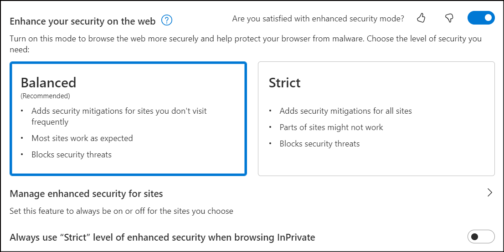
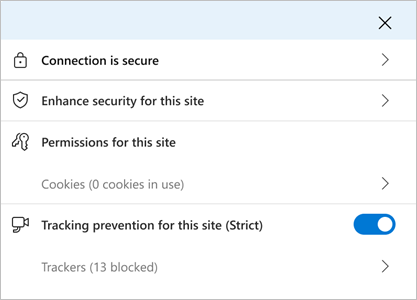

# Browse more safely with Microsoft Edge

> [!NOTE]
> Microsoft Edge for Business, the new, dedicated work experience for Microsoft Edge, is in preview today! [Try Microsoft Edge for Business](/deployedge/microsoft-edge-for-business), including the switching between work and personal browsing, and let us know what you think.

This article describes how Microsoft Edge provides enhanced security on the web.

> [!NOTE]
> This article applies to Microsoft Edge version 111 or later. Some users might see enhanced security turned on by default due to ongoing development and testing. If you want to turn the security feature off, refer to the [What's new in Microsoft Edge security settings](#whats-new-in-microsoft-edge-security-settings) in this article.

> [!IMPORTANT]
> Developers should be aware that the WebAssembly (WASM) interpreter running in enhanced security mode might not yield the expected level of performance. We recommend adding your site as an [exception](#enhanced-security-sites) to opt-out of enhanced security mode for site users.

## Overview

Microsoft Edge is adding enhanced security protections to provide an extra layer of protection when browsing the web and visiting unfamiliar sites. The web platform is designed to give you a rich browsing experience using powerful technologies like JavaScript. On the other hand, that power can translate to more exposure when you visit a malicious site. With enhanced security mode, Microsoft Edge helps reduce the risk of an attack by automatically applying more conservative security settings on unfamiliar sites and adapts over time as you continue to browse.

## Defense in depth

Enhanced security mode in Microsoft Edge mitigates memory-related vulnerabilities by disabling just-in-time (JIT) JavaScript compilation and enabling additional operating system protections for the browser. These protections include [Hardware-enforced Stack Protection](https://techcommunity.microsoft.com/t5/windows-kernel-internals-blog/developer-guidance-for-hardware-enforced-stack-protection/ba-p/2163340) and [Arbitrary Code Guard (ACG)](/microsoft-365/security/defender-endpoint/exploit-protection-reference?view=o365-worldwide#arbitrary-code-guard&preserve-view=true).

When combined, these changes help provide 'defense in depth' because they make it more difficult than ever before for a malicious site to use an unpatched vulnerability to write to executable memory and attack an end user. You can learn more about the experimentation results from the Microsoft Edge Security team's [blog post](https://microsoftedge.github.io/edgevr/posts/Super-Duper-Secure-Mode) and [Introducing Enhanced Security for Microsoft Edge](https://microsoftedge.github.io/edgevr/posts/Introducing-Enhanced-Security-for-Microsoft-Edge/).

You may also be interested to learn more about the first line [security protections in Microsoft Edge](/deployedge/ms-edge-security-for-business). Notably, you may want to learn more about how [Microsoft Edge SmartScreen](/deployedge/microsoft-edge-security-smartscreen) protects users from phishing scams and malware downloads.

> [!NOTE]
> WebAssembly is now supported in enhanced security mode for x64 Windows, x64 macOS, x64 Linux, and ARM64 systems.

## What's new in Microsoft Edge security settings

With **Enhance your security on the web**, Microsoft Edge gives you an extra layer of protection when browsing the web.

> [!NOTE]
> Enhanced security on the web runs on  unfamiliar sites without the just in time (JIT) compilation to reduce attack surface, making it difficult for malicious sites to exploit.
>
>This additional protection includes Windows operating system mitigations such as Hardware Enforced Stack Protection, Arbitrary Code Guard (ACG), and Control Flow Guard (CFG).

Use the following steps to configure added security.

1. In Microsoft Edge, go to **Settings and more** > **Settings** > **Privacy, search, and services**.
2. Under **Security**, verify that **Enhance your security on the web** is enabled.
3. Select the option that's best for your browsing.

The following toggle settings are available:

- Toggle Off (Default): Feature is turned off  
- Toggle On – Balanced (Recommended): Microsoft Edge will apply added security protections when users visit  unfamiliar sites but bypass those protections for commonly visited sites. This combination provides a practical level of protection against attackers while preserving the user experience for a user's usual tasks on the web.
- Toggle On – Strict: Microsoft Edge will apply added security protections for all the sites a user visits. Users may report some challenges accomplishing their usual tasks.

The following screenshot shows the "Enhance your security on the web" configuration page, with Balanced security mode enabled and set to provide Balanced security.

<!--:::image type="content" source="media/microsoft-edge-security-browse-safer/browse-safer-enhance-security-dialog2.png" alt-text="Dialog to configure balanced security on the web."::: -->

### How "Balanced" mode works

Balanced mode is an adaptive mode that builds on user's behavior on a particular device, and Microsoft's understanding of risk across the web to give sites that users are most likely to use and trust full access to the web platform, while limiting what new and unfamiliar sites can do when visited.

### How "Strict" mode works

As the name suggests, Strict Mode applies these security protections to all sites by default. However, you can still manually add sites to the exception site list and enterprise admin configuration will still apply, if present. Strict mode isn't appropriate for most end users because it may require some level of configuration for the user to complete their normal tasks.

### Enhanced security sites

In Balanced and Strict mode, you can also create exceptions for certain familiar websites that you trust or wish to enforce these modes on. Use the following steps to add a site to your list.

1. In Microsoft Edge, select **Settings and more** > **Settings** > **Privacy, search, and services**.
2. Verify that **Enhance your security on the web** is turned on.
3. Under **Enhance your security on the web**, select **Manage enhanced security for sites**.
4. Select **Add a site**, type in the full URL, and then select **Add**.

> [!NOTE]
> You can use steps (1 - 3) to view sites in **enhanced security sites.**. You can **Edit** a site, **Remove** a site, or **Remove all** exceptions.

The next screenshot shows the settings page for security exceptions.

<!----
:::image type="content" source="media/microsoft-edge-security-browse-safer/browse-safer-enhanced-exceptions.png" alt-text="Settings page for configuring security exceptions":::-->

### Enterprise controls

Enterprise Admins can configure this security feature using Group Policy settings, including creating "Allow" and "Deny" lists to explicitly enhance security for their users when visiting certain sites, or disable the mode for others. For a complete list of policies, see the [Microsoft Edge browser policy documentation](/deployedge/microsoft-edge-policies).

> [!NOTE]
> Setting the [EnhanceSecurityMode](/deployedge/microsoft-edge-policies#enhancesecuritymode) policy to 'StrictMode' or setting the [DefaultJavaScriptJitSetting](/deployedge/microsoft-edge-policies#defaultjavascriptjitsetting) policy to BlockJavaScriptJit will have the same effect as changing the **Enhance your security on the web** setting in *edge://settings/privacy* to 'Strict'.

## User experience with enhanced security mode

After a user turns on enhanced security mode, they'll see a banner with the words "Added security" in their URL navigation bar when Microsoft Edge is applying enhanced security mode for a particular site.

<!--
:::image type="content" source="media/microsoft-edge-security-browse-safer/browse-safer-added-security-banner.png" alt-text="Banner showing that added security is turned on.":::-->

When you select the banner, you'll see the next flyout. You can select "Enhance security for this site" to redirect you to a second flyout that shows the security settings for the current site and gives the user the option to toggle security on or off.

> [!NOTE]
> "Enhance security for this site" only appears when enhanced security mode is enabled in Microsoft Edge Settings.

<!--:::image type="content" source="media/microsoft-edge-security-browse-safer/browse-safer-enhance-security-for-site-option.png" alt-text="Shows the option to enhance security for current site.":::-->

In the flyout shown in the next screenshot, you can manually enable or disable enhanced security mode for a particular site. If you change the "Use enhanced security for this site" toggle, Microsoft Edge will proactively add that site to the exception site list.

> [!NOTE]
> You can always remove this site by updating the exception site list in **Settings** > **Privacy, search, and services** > **Enhanced security exceptions**.

<!--:::image type="content" source="media/microsoft-edge-security-browse-safer/browse-safer-enhance-security-for-site-toggle.png" alt-text="Shows security settings for site with toggle to turn security on or off.":::-->

## Send us feedback

We want to get your feedback on our next iteration to improve "enhanced security mode". If something doesn't work the way you expect, or if you have feedback to share on these changes, we want to hear from you. You can reach out to Microsoft Support to report issues or feedback. You can also leave feedback in our [TechCommunity forum](https://techcommunity.microsoft.com/t5/enterprise/bd-p/EdgeInsiderEnterprise).

## See also

- [Video: Secure browsing on Microsoft Edge](microsoft-edge-video-security-smartscreen.md)
- [Super Duper Secure Mode](https://microsoftedge.github.io/edgevr/posts/Super-Duper-Secure-Mode/)
- [Microsoft Edge Enterprise landing page](https://aka.ms/EdgeEnterprise)
