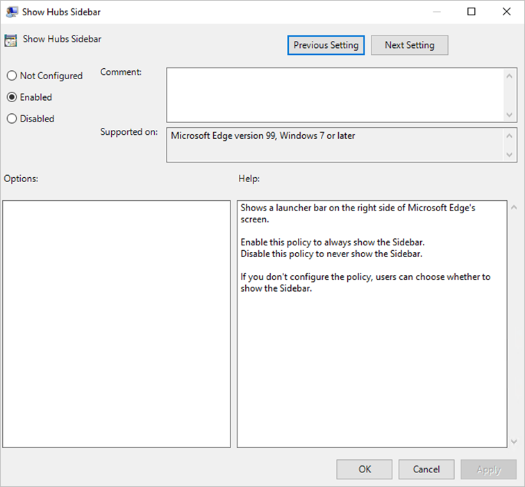
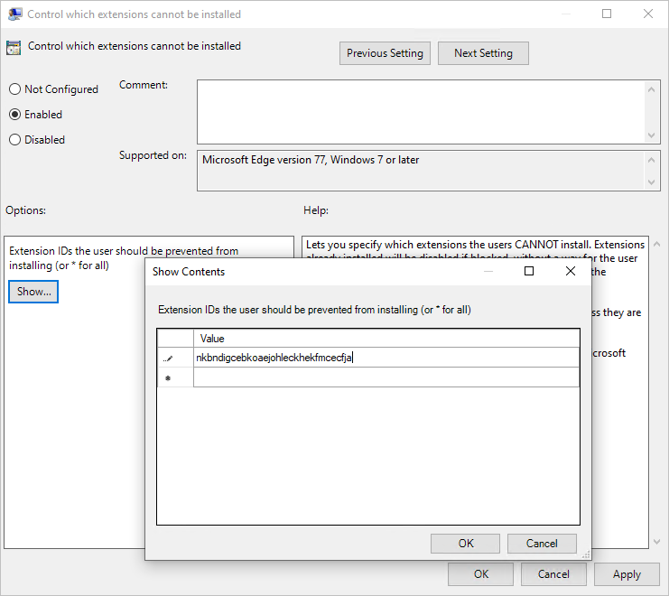

# Manage the sidebar in Microsoft Edge

This article describes the sidebar in Microsoft Edge and provides information about the  procedures that admins can use to manage this feature  in their organization.
<!-- ======= Microsoft Edge management service GA July 20 ========= -->
## Introduction to the sidebar

For a growing number of people, the browser has become the place where work happens. As the transition from juggling apps to switching tabs entrenches web-based tools in our workflows, the risks to productivity mount. With the sidebar in Microsoft Edge, Enterprise users can access the productivity tools they need while staying in their workflow.

## Use group policies to manage the sidebar

Admins have several policy options for deploying and managing the sidebar in their organization. The following policies can be applied to the sidebar and the individual apps referenced by the sidebar.

| Policy Name | Caption |
|:-----|:-----|
| [HubsSidebarEnabled](/deployedge/microsoft-edge-policies#hubssidebarenabled) | Show Hubs Sidebar |
| [ExtensionInstallBlockList](/deployedge/microsoft-edge-policies#extensioninstallblocklist) | Control which extensions cannot be installed |
| [ExtensionInstallAllowList](/deployedge/microsoft-edge-policies#extensioninstallallowlist) |  Allow specific extensions to be installed |
| [ExtensionInstallForceList](/deployedge/microsoft-edge-policies#extensioninstallforcelist) | Control which extensions are installed silently |

> [!NOTE]
> The reuse of Extensions-specific policies for managing the sidebar is intentional and intended to promote flexibility. Navigate to `edge://sidebar-internals` in your browser to find the extension IDs associated with individual sidebar apps.

## Allow or block the sidebar in group policy

You can use [HubsSidebarEnabled](/deployedge/microsoft-edge-policies#hubssidebarenabled) policy to control whether the sidebar is allowed or blocked in your organization. Blocking the sidebar will automatically block all sidebar apps from being enabled.

1. Open the group policy editor and go to **Administrative Templates** > **Microsoft Edge** and then select **Show Hubs Sidebar**.
2. To block the sidebar and all sidebar apps, select **Disabled**.
3. To allow the sidebar, select **Enabled**.

Note that blocking the sidebar removes access to the new Discover app that appears in the toolbar (Microsoft Edge 111 or later).

## Block specific sidebar apps

You can use the [ExtensionInstallBlockList](/deployedge/microsoft-edge-policies#extensioninstallblocklist) policy to control which sidebar apps are blocked.

Use the following steps as a guide to block a sidebar app.

1. Open the group policy management editor and go to **Administrative Templates** > **Microsoft Edge** > **Extensions** and then select **Control which extensions cannot be installed**.
2. Select **Enabled**.
3. Click **Show**.
4. Enter the extension ID of the sidebar app that you want to block.
   -  You can find Extension IDs for sidebar apps by going `edge://sidebar-internals`.
   - The Sidebar Internals JSON file includes a manifest for all sidebar apps, including an `extension_id` parameter for each app. You can use these values to configure the policy.
   - When adding multiple ID's use a separate row for each ID.
5. To block all sidebar apps, refer to [Allow or block the sidebar in group policy](#allow-or-block-the-sidebar-in-group-policy). Disabling the HubsSidebarEnabled policy blocks all sidebar apps by default.

## Allow specific sidebar apps

You can use the [ExtensionInstallBlocklist](/deployedge/microsoft-edge-policies#extensioninstallblocklist) and [ExtensionInstallAllowlist](/deployedge/microsoft-edge-policies#extensioninstallallowlist) policies to allow specific sidebar apps while blocking the rest of the sidebar apps. Use the following steps as a guide to exempt a specific sidebar app from the blocklist.

1. Open the group policy management editor and go to **Administrative Templates** > **Microsoft Edge** > **Extensions** and then select "Control which extensions cannot be enabled".
2. Select **Enabled**.
3. Click **Show**.
4. Enter **\***.

   Use group policy to see what extensions can't be enabled:

   

5. In the group policy management editor, go to **Administrative Templates** > **Microsoft Edge** > **Extensions** and then select "Allow specific extensions to be installed".
6. Enter the **Extension ID** of the sidebar app that you want to allow.
   1. You can find Extension IDs for sidebar apps by going to `edge://sidebar-internals` from the omnibox in Microsoft Edge.
   1. The resulting manifest (which can be exported to JSON file) lists all the  sidebar apps including an `extension_id` parameter for each app. You can use these values to configure the policy.
   1. When adding multiple ID's, use a separate row for each ID.
7. The user can then choose to enable/disable the allowed sidebar app. To force enable a sidebar app, refer to the next section, which has information about the [ExtensionInstallForcelist](/deployedge/microsoft-edge-policies#extensioninstallforcelist) policy.

   Use group policy to allow the installation of specific extensions:

   

## Force enable specific sidebar apps

Use the [ExtensionInstallForceList](/deployedge/microsoft-edge-policies#extensioninstallforcelist) policy to enable specific sidebar apps that users in your organizataion can't disable. Use the following steps as a guide to force enable a sidebar app.

1. In the Group Policy Editor, go to **Administrative Templates** > **Microsoft Edge** > **Extensions** and then select **Control which extensions are installed silently**.
2. Select **Enabled**.
3. Click **Show**.
4. Enter the extension ID(s) for the sidebar apps you want to force enable.

The sidebar app is enabled silently without needing any user interaction. The user won't be able to remove this app from the sidebar. This setting will overwrite any blocklist policy that's enabled.

## See also

- [Microsoft Edge Enterprise landing page](https://aka.ms/EdgeEnterprise)