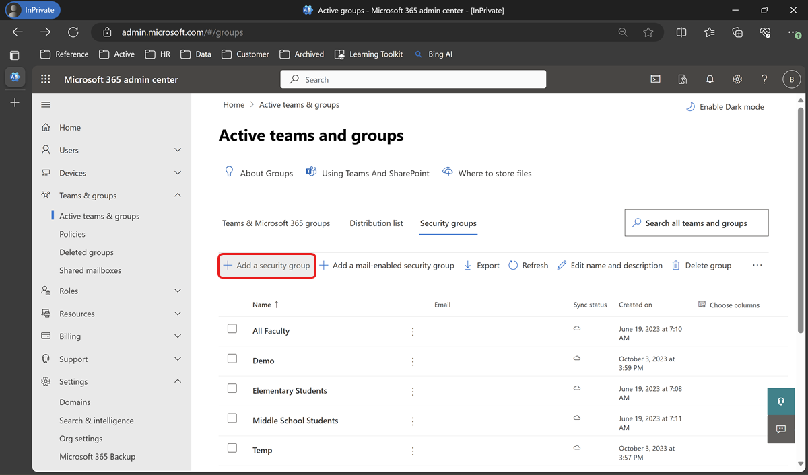
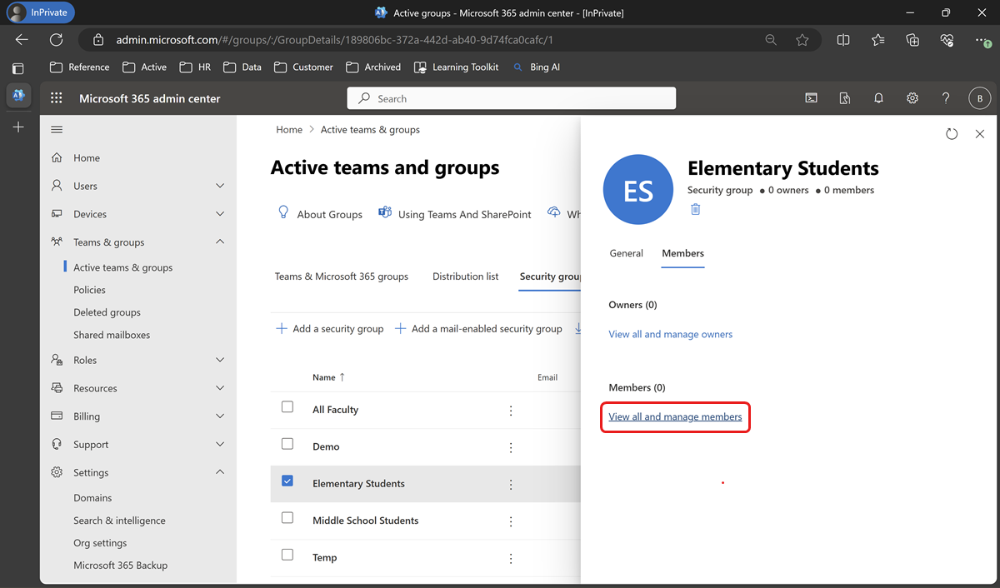
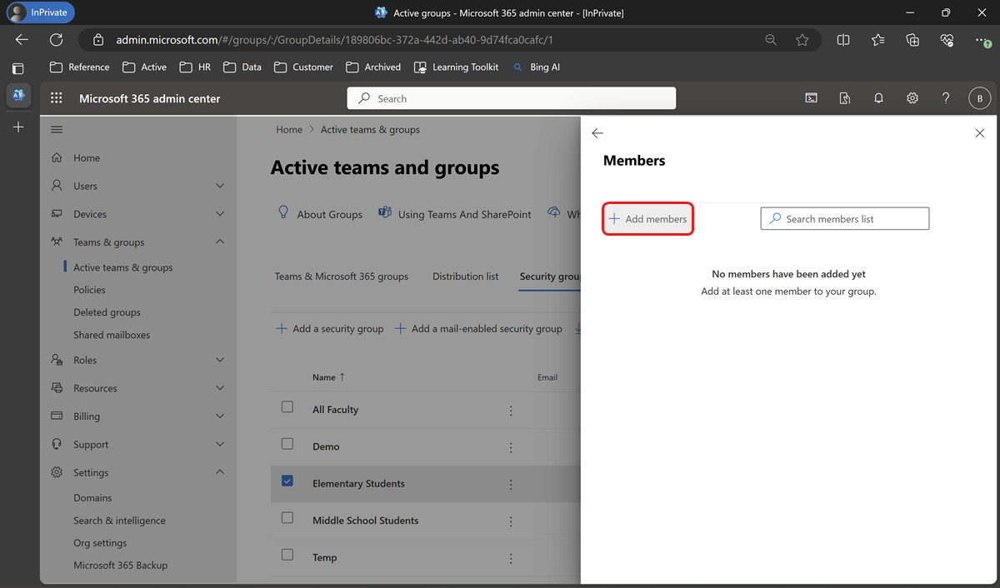
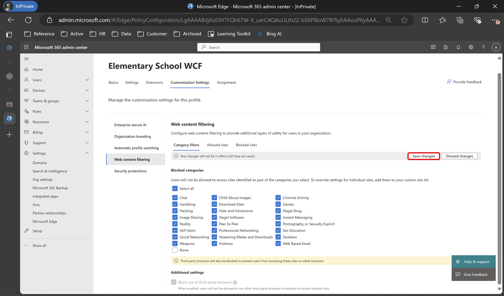
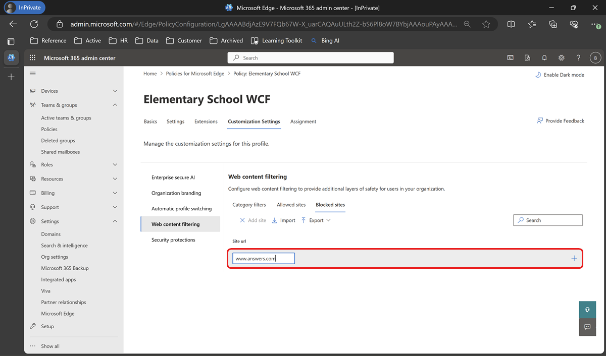
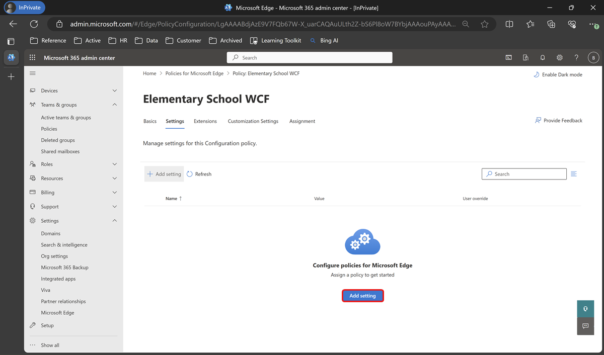
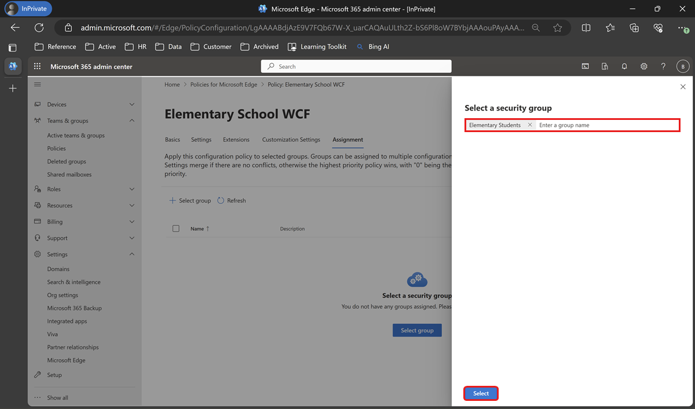
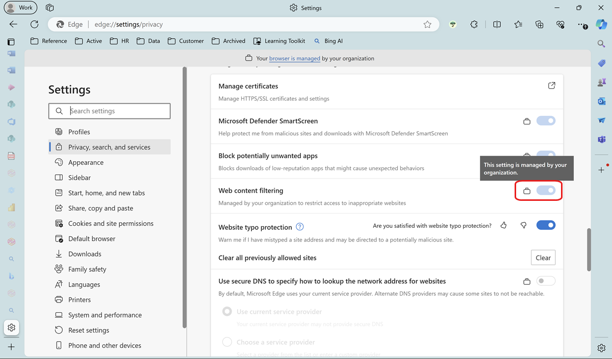
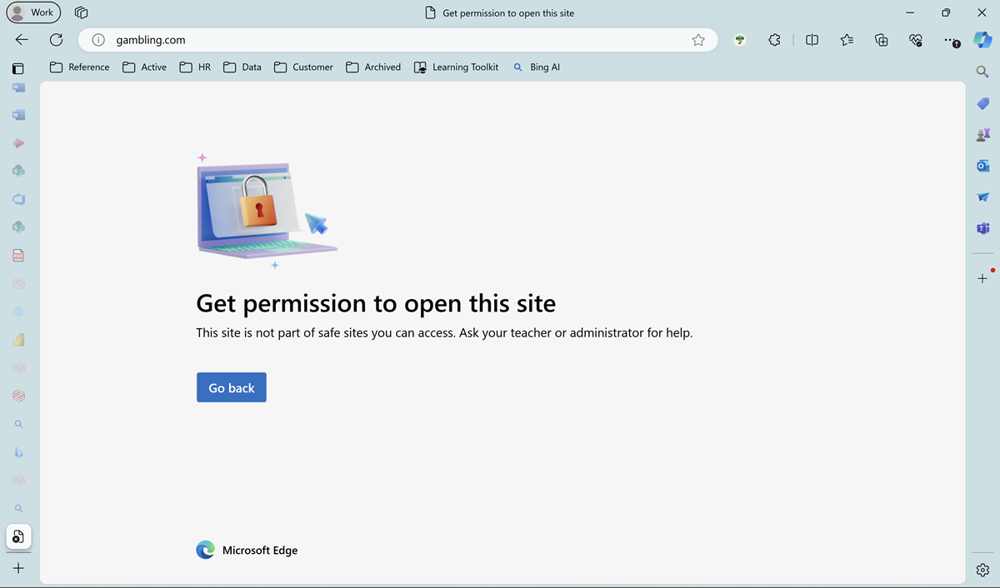

# Configure Web Content Filtering on Edge using Edge management service

This article describes how to configure Web Content Filtering (WCF) for Microsoft Edge.

## Introduction

Microsoft Edge is already one of the most secure browsers with features like phishing protection, typosquatting, and more to protect users when they're browsing online. Adding to these security features, Microsoft Edge is introducing Web Content Filtering (WCF) for Educational Institutions to help them keep students safe online. Using this feature, you can choose categories of websites that students aren't allowed to access while using Microsoft Edge.

To use this feature, set it up via the Microsoft Edge management service using the following the steps.

## Prerequisites

Before you can set up WCF you must meet or exceed the following prerequisites.

1. On managed Windows devices where WCF policy needs to be applied:  
   - Be signed in with school account on a device running Windows 10 or later.
   - Have Microsoft Edge Version 118 or higher installed.
2. You must be a Microsoft Edge Administrator or a Global Administrator to access this experience in Microsoft 365 Admin Center.
3. You must have a Microsoft Intune license.

> [!NOTE]
> Make sure you update Microsoft Edge to latest version on all the managed devices where you want to run Web Content Filtering (WCF).

## Setup steps

This section describes and illustrates the six basic steps for setting up WCF:

- [Create a security group to enable WCF](#create-a-security-group-to-enable-wcf)
- [Enable WCF for a Security group](#enable-wcf-for-a-security-group)
- [Manage exceptions via Allowlist and Blocklist](#manage-exceptions-via-allowlist-and-blocklist)
- [Enable Diagnostic data (Optional)](#enable-diagnostic-data-optional)
- [Assign the WCF policy to a group](#assign-the-wcf-policy-to-a-group)
- [Verify that the WCF policy got applied](#verify-that-the-wcf-policy-got-applied)

### Create a security group to enable WCF

> [!TIP]
> If you have pre-existing groups on Intune, they will automatically get imported to Edge management service. You can reuse them here without any additional work.

To create a group on Edge management service, open the Microsoft 365 admin center.

1. Go to **Active teams & groups** > **Security groups**, and then select **Add a security group**.

<!----screen 1 Active teams & groups 

-->

2. Under **Set up the basics**, enter a name and description for the group and then select **Next** to create the group.

<!----screen 2 Setup the basics 

-->

3. Under **Active teams and groups**, select the  group you created and then go the **Members** section. Select **View all and manage members** to add **Owners** and **Members** to the group.

<!----screen 3 Active teams and groups 

-->

4. On the **Members** panel, select **Add members**. 

<!----screen 4 Members 

-->

5. On the **Add members** panel, under **Display name**, check the members you want to add.

<!----screen 5 Add Members list 

-->

> [!NOTE]
> We recommend that you test the policy on a small set of user groups (the IT team and/or teachers) before rolling the WCF policy out to students.

### Enable WCF for a Security group

To enable WCF for a security group:

1. Go to **Settings** > **Microsoft Edge** > **Configuration policies** and then select **Create policy**.
2. Provide a **Name** and **Description**, and then select **Create**.

<!----screen 6 create a config policy  

-->

3. In policy settings, go to **Customization Settings** > **Web content filtering**.
4. Under **Web content filtering** there's a list of categories that you can block. Under **Blocked categories**, check all the categories that you want to block and then select **Save Changes**.

<!----screen 7 create a customization settings  

-->

> [!IMPORTANT]
> To ensure full safety for students, enabling this policy will block all third-party browsers because they do not have a web content filtering feature.

### Manage exceptions via Allowlist and Blocklist

With the necessary categories blocked, you can check the behavior for the top used URLs in your institution and use the Allowlist and Blocklist capabilities to manage any exceptions.

If you want to allow a particular URL that is part of a blocked category, then you can add the URL to the list of Allowed Sites by the following steps.

1. Under Web content filtering, select **Allowed Sites**.
2. Type in the URL of the site you want to allow and then select "**+**"
3. Select **Save Changes**.

<!----screen 8 filtering allowed sites  

-->

> [!TIP]
> Instead of adding the URLs manually, you can import them in bulk using a .csv or .json file with the **Import** option.

Similarly, if you want to block a particular URL or list of URLs, you can repeat the previous steps in the **Blocked sites** section.

<!----screen 9 filtering blocked sites  

-->

> [!NOTE]
> In addition to URLs you can use URL patterns with wildcard characters, which are supported. For more information, see **????**

> [!IMPORTANT]
> Allowlist takes precedence over Blocklist and Blocked categories. You can read more about this here .**????**

### Enable Diagnostic data (Optional)

Web Content Filtering (WCF) on Microsoft Edge is in preview and our aim is to make it as safe and seamless as possible. For us to be able to watch the behavior of this feature and diagnose any issues that might arise during the preview, we recommend that you enable **Optional data** on the devices that you're enabling WCF on. Microsoft values your privacy, and we won't collect or use personal data.

1. To enable **Diagnostic data** open the policy configuration page and go to **Settings**.
2. Select **Add setting**.

<!----screen 10 policy/settings/search  

-->

3. Search for "DiagnosticData" and on the **Configure a setting** panel, under **Required data**, set the value to **Optional data**.
4. Select **Save**.

<!----screen 11 optional data  

-->

### Assign the WCF policy to a group

Now that the policy has WCF, Allowlist & Blocklist, and Diagnostic data settings configured you can assign this policy to a group.

1. On the policy page, select **Assignment**.
2. Click **Select Group**.

<!----screen 12 assignment  

-->

3. On the **Select a security group** panel, add the groups you want to assign the policy to and then click **Select**.

<!----screen 13 select group  

-->

### Verify that the WCF policy got applied

You can check whether the policy got applied on the respective user's Edge browser by opening Microsoft Edge **Settings**. Under **Privacy, search, and services** and see that **Web content filtering** is enabled as shown in the next screenshot.

<!----screen 14 settings/web content filtering  

-->

When you try to access a site that WCF blocks, you should see a screen like the one in the next screenshot.

<!----screen 15 error response  

-->

> [!NOTE]
> It can take up to 90 minutes for the policy set on Edge management service to get applied on a device.

> [!TIP]
> If you have the same policy setup via Intune and EMX, Intune policy takes precedence by default. You can override this default behavior using the [EdgeManagementPolicyOverridesPlatformPolicy](/deployedge/microsoft-edge-policies#edgemanagementpolicyoverridesplatformpolicy) and the  [EdgeManagementUserPolicyOverridesCloudMachinePolicy](/deployedge/microsoft-edge-policies#edgemanagementuserpolicyoverridescloudmachinepolicy) settings in the browser policy documentation.

## See also

- [Microsoft Edge management service](/deployedge/microsoft-edge-management-service)
- [Microsoft Edge Enterprise landing page](https://aka.ms/EdgeEnterprise)